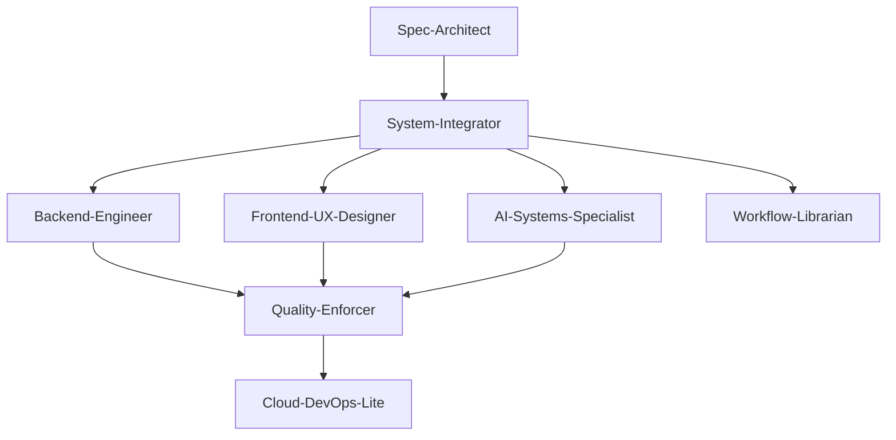

# Agent Integration Guide

## Overview
This document explains how the 8 Core Strategic Sub-agents work together to support the complete evolution of the Todo app from console (Phase I) to full-stack web (Phase II) to AI chatbot (Phase III).

## Agent Responsibilities & Connections



## Agent Details & Interactions

### 1. Spec-Architect
**Core Responsibility:** Architecture planning, task breakdown, ADR creation
**Skills:** Architecture planning, task breakdown, documentation
**Key Integrations:**
- **System-Integrator:** Provides architecture specifications for system setup
- **All Agents:** Ensures all implementations follow approved plans
- **Workflow-Librarian:** Documents decisions and updates specifications

### 2. Backend-Engineer
**Core Responsibility:** Python/FastAPI/SQLModel backend development
**Skills:** API endpoints, database models, CRUD operations, MCP tools
**Key Integrations:**
- **System-Integrator:** Receives database schema and API contracts
- **AI-Systems-Specialist:** Provides MCP tool implementations
- **Quality-Enforcer:** Submits code for review and testing
- **Cloud-DevOps-Lite:** Provides application for containerization

### 3. Frontend-UX-Designer
**Core Responsibility:** Next.js/ChatKit/Console UI development
**Skills:** React components, Tailwind styling, chat interfaces
**Key Integrations:**
- **System-Integrator:** Receives type definitions and API contracts
- **AI-Systems-Specialist:** Implements ChatKit integration
- **Quality-Enforcer:** Submits components for review
- **Cloud-DevOps-Lite:** Provides frontend build configuration

### 4. AI-Systems-Specialist
**Core Responsibility:** OpenAI Agents SDK and MCP server implementation
**Skills:** Agent development, MCP tools, stateless architecture, conversation management
**Key Integrations:**
- **Backend-Engineer:** Uses MCP tools for task operations
- **Frontend-UX-Designer:** Integrates with ChatKit UI
- **Quality-Enforcer:** Validates stateless architecture compliance
- **Spec-Architect:** Follows AI integration specifications

### 5. Quality-Enforcer
**Core Responsibility:** Code review, testing, performance validation
**Skills:** Test generation, code analysis, security scanning
**Key Integrations:**
- **All Agents:** Reviews code from all development agents
- **Workflow-Librarian:** Validates documentation quality
- **Cloud-DevOps-Lite:** Validates deployment configurations

### 6. Workflow-Librarian
**Core Responsibility:** Documentation, version control, i18n setup
**Skills:** Git operations, documentation generation, translation management
**Key Integrations:**
- **Spec-Architect:** Maintains ADRs and specifications
- **Quality-Enforcer:** Ensures documentation standards
- **System-Integrator:** Documents integration patterns

### 7. System-Integrator
**Core Responsibility:** Monorepo setup, API sync, phase transitions
**Skills:** Workspace management, schema synchronization, phase evolution
**Key Integrations:**
- **Spec-Architect:** Implements architecture decisions
- **Backend-Engineer:** Synchronizes database schemas
- **Frontend-UX-Designer:** Syncs TypeScript interfaces
- **AI-Systems-Specialist:** Coordinates AI feature integration

### 8. Cloud-DevOps-Lite
**Core Responsibility:** Containerization, K8s prep, deployment automation
**Skills:** Docker configuration, manifests, CI/CD setup
**Key Integrations:**
- **System-Integrator:** Provides applications for deployment
- **Quality-Enforcer:** Validates deployment configurations
- **All Agents:** Deploys validated code

## Phase Evolution Support

### Phase I (Console App)
```
Spec-Architect → System-Integrator
        ↓               ↓
Backend-Engineer (CLI) → Quality-Enforcer
        ↓
Workflow-Librarian → Cloud-DevOps-Lite
```

### Phase II (Web Application)
```
Spec-Architect → System-Integrator
        ↓               ↓         ↓
Backend-Engineer ← → Frontend-UX-Designer
        ↓               ↓         ↓
Quality-Enforcer ← ← → Cloud-DevOps-Lite
        ↓
Workflow-Librarian
```

### Phase III (AI Chatbot)
```
Spec-Architect → System-Integrator
        ↓               ↓         ↓         ↓
Backend-Engineer ← → AI-Systems-Specialist ← → Frontend-UX-Designer
        ↓               ↓         ↓         ↓
Quality-Enforcer ← ← → Cloud-DevOps-Lite
        ↓
Workflow-Librarian
```

## Development Workflow

### 1. Specification Phase
1. **Spec-Architect** creates specifications and task breakdown
2. **System-Integrator** reviews feasibility and creates integration plan
3. **Workflow-Librarian** documents decisions and updates constitution

### 2. Implementation Phase
1. **Backend-Engineer**, **Frontend-UX-Designer**, **AI-Systems-Specialist** implement features
2. **System-Integrator** ensures components work together
3. **Quality-Enforcer** continuously validates code quality

### 3. Deployment Phase
1. **Cloud-DevOps-Lite** prepares deployment configurations
2. **Quality-Enforcer** validates deployment readiness
3. **Workflow-Librarian** updates documentation

## Communication Protocols

### API Contracts
- **System-Integrator** defines API contracts
- **Backend-Engineer** implements endpoints
- **Frontend-UX-Designer** consumes APIs
- **AI-Systems-Specialist** extends APIs with MCP tools

### Type Definitions
- **Backend-Engineer** provides Pydantic models
- **System-Integrator** synchronizes to TypeScript
- **Frontend-UX-Designer** uses synchronized types
- **AI-Systems-Specialist** validates type compatibility

### Quality Gates
- **Quality-Enforcer** enforces standards
- **All Agents** submit for review
- **Workflow-Librarian** documents quality metrics
- **Spec-Architect** validates compliance

## Transition Support

### Phase I → Phase II
1. **Spec-Architect** creates migration ADR
2. **System-Integrator** manages transition
3. **Backend-Engineer** migrates CLI to API
4. **Frontend-UX-Designer** creates web UI
5. **Cloud-DevOps-Lite** prepares web deployment

### Phase II → Phase III
1. **Spec-Architect** designs AI integration
2. **AI-Systems-Specialist** implements MCP server
3. **Backend-Engineer** extends API with chat endpoint
4. **Frontend-UX-Designer** integrates ChatKit
5. **Quality-Enforcer** validates stateless architecture

## Success Metrics

### Development Velocity
- Time from specification to deployment
- Number of code review iterations
- Test coverage and pass rate
- Migration time between phases

### Code Quality
- Architecture compliance score
- Test coverage percentage
- Performance benchmarks
- Security scan results

### System Health
- API response times
- Error rates
- System uptime
- Resource utilization

## Best Practices

### Agent Collaboration
1. **Clear interfaces** - Well-defined contracts between agents
2. **Version control** - Track changes across agents
3. **Continuous integration** - Validate integration continuously
4. **Documentation** - Keep integration patterns documented

### Phase Evolution
1. **Backward compatibility** - Support previous phases during transition
2. **Gradual migration** - Roll out changes incrementally
3. **Rollback plans** - Prepare for quick recovery
4. **Feature flags** - Toggle features between phases

### Quality Assurance
1. **Automated testing** - Test at agent boundaries
2. **Integration testing** - Test agent interactions
3. **Performance monitoring** - Track system metrics
4. **Security scanning** - Scan for vulnerabilities

## Troubleshooting

### Common Issues
1. **API contracts mismatch** - Use System-Integrator to sync schemas
2. **Type inconsistencies** - Regenerate type definitions
3. **Deployment failures** - Check Cloud-DevOps-Lite configurations
4. **Quality gate failures** - Review with Quality-Enforcer

### Resolution Process
1. **Identify agent** - Which agent is responsible?
2. **Review integration** - Check interaction points
3. **Validate contracts** - Ensure agreements are met
4. **Test changes** - Validate fix works

## Future Enhancements

### Additional Agents
As the project evolves to Phase IV and V, consider adding:
- **Event-Driven Architect** - For Kafka/Dapr integration
- **Monitoring-Specialist** - For advanced observability
- **Security-Guardian** - For advanced security

### Enhanced Automation
- Self-healing systems
- Predictive scaling
- Automated testing
- Continuous deployment optimization

This integrated agent architecture ensures smooth evolution through all phases while maintaining high quality and consistency.