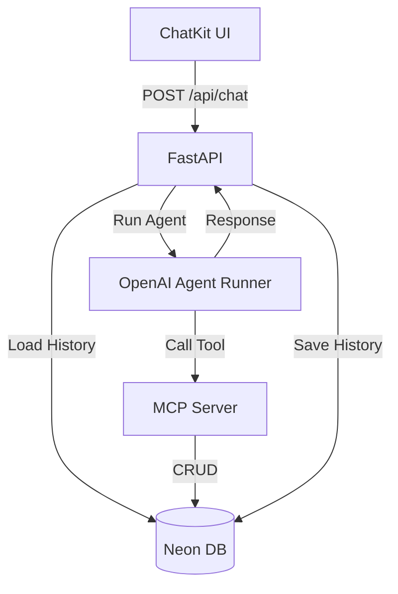

# Implementation Plan: AI-Powered Todo Chatbot

**Branch**: `003-ai-chatbot` | **Date**: 2025-12-13 | **Spec**: [spec.md](./spec.md)
**Input**: Feature specification from `/specs/003-ai-chatbot/spec.md`

**Note**: This plan extends Phase II architecture with AI agent capabilities, MCP tool integration, and conversational interface.

## Summary

This feature adds AI-powered conversational interface to the existing Phase II todo application using **MCP (Model Context Protocol)** server architecture. Users will interact with an AI agent through natural language to create, view, update, complete, and delete tasks. The agent uses MCP tools to execute task operations, maintaining stateless architecture with database-backed conversation history. OpenAI ChatKit provides the conversational UI, while OpenAI Agents SDK orchestrates agent behavior.

**Primary Requirement**: Users can manage their entire task workflow through natural language conversation instead of traditional CRUD forms.

**Technical Approach**: Stateless AI agent endpoint integrated with existing FastAPI backend, exposing task CRUD operations as MCP tools via the Official MCP SDK, persisting conversation state to PostgreSQL, and rendering chat interface via OpenAI ChatKit in Next.js frontend.

**Development Approach**: Agentic Dev Stack (Spec → Plan → Tasks → Implement)

## Technical Context

**Language/Version**:
- Backend: Python 3.13+ (existing)
- Frontend: TypeScript 5+ with Next.js 15 (existing)

**Primary Dependencies**:
- Backend:
  - `openai` (>= 1.0.0) - OpenAI Agents SDK for agent orchestration
  - `mcp` (>= 1.0.0) - Official MCP SDK (Model Context Protocol)
  - Existing: FastAPI 0.109+, SQLModel 2.0+ (ORM), asyncpg, Better Auth (JWT authentication)
- Frontend:
  - `@openai/chatkit` - OpenAI's conversational UI components
  - Existing: Next.js 15, React 18, Tailwind CSS

**Storage**:
- Neon Serverless PostgreSQL (existing) with two new tables:
  - `conversations` (user_id, conversation_id, created_at, updated_at)
  - `messages` (message_id, conversation_id, role, content, created_at)
- Existing `users` and `tasks` tables unchanged

**Architecture Flow** (Stateless):
The server holds NO state. It persists conversation state to the database on every turn.



**Testing**:
- Backend: pytest with async support for MCP tools and agent integration
- Frontend: Jest + React Testing Library for ChatKit components
- Integration: Multi-turn conversation flow tests

**Target Platform**:
- Backend: Linux server (existing deployment)
- Frontend: Vercel (existing deployment)
- AI Service: OpenAI API (cloud)

**Project Type**: Web application (frontend + backend)

**Performance Goals**:
- AI response latency: < 3 seconds for 95% of requests
- Conversation history load: < 2 seconds for 50 messages
- Token usage: 100-500 tokens per conversation turn
- Concurrent conversations: 100+ simultaneous users

**Constraints**:
- Stateless agent design (any server instance handles any request)
- Must preserve all Phase II functionality
- Must enforce same data isolation as Phase II
- Token budget management (prevent runaway costs)
- OpenAI API rate limits

**Scale/Scope**:
- New endpoints: 2 (POST /api/chat, GET /api/conversations)
- MCP tools: 5 (add_task, list_tasks, complete_task, update_task, delete_task)
- New database tables: 2 (conversations, messages)
- New frontend pages: 1 (/chat)
- Estimated LOC: 1500 backend, 800 frontend

## Constitution Check

*GATE: Must pass before Phase 0 research. Re-check after Phase 1 design.*

### Phase III Specific Principles (from constitution v3.0.0)

✅ **Stateless Agent Design**:
- Agent endpoints have no in-memory session state
- Conversation history loaded from database on each request
- Plan: Chat endpoint loads messages from DB, passes to agent, saves response

✅ **MCP Tool Integration**:
- Task operations exposed as MCP tools with user_id validation
- Plan: 5 MCP tools wrapping existing CRUD functions from Phase II

✅ **Conversation State Management**:
- Conversations and messages tables in database
- Plan: Alembic migration adds both tables with proper indexes

✅ **Natural Language Processing**:
- AI agent interprets intent and selects appropriate tools
- Plan: Agent configured with system prompt defining tool usage patterns

✅ **Technology Stack (Phase III)**:
- OpenAI Agents SDK: ✅ Planned
- MCP SDK: ✅ Planned
- OpenAI ChatKit: ✅ Planned
- Phase II stack preserved: ✅ No breaking changes

✅ **Code Quality Standards**:
- Agent behavior documented in spec: ✅ Complete
- Rate limiting on chat endpoints: ✅ Planned in implementation
- Token usage tracking: ✅ Planned in agent service
- User_id validation on all tools: ✅ Required in tool specs

### Phase Transition Rules

✅ **Phase II Complete**: All 6 user stories implemented, web CRUD functional

✅ **Migration ADR**: Created (ADR-002)

✅ **Backward Compatibility**: Phase II endpoints and UI remain unchanged

✅ **Constitution Updated**: v2.0.0 → v3.0.0

**GATE STATUS**: ✅ PASSED - All Phase III principles satisfied, ready for implementation

## Project Structure

### Documentation (this feature)

```text
specs/003-ai-chatbot/
├── spec.md              # Feature specification (/sp.specify output) ✅
├── plan.md              # This file (/sp.plan output) ✅
├── research.md          # Technology decisions and best practices ⏳
├── data-model.md        # Database schema extensions ⏳
├── quickstart.md        # Development setup guide ⏳
├── contracts/           # MCP tool specifications ⏳
│   ├── add-task.json
│   ├── list-tasks.json
│   ├── complete-task.json
│   ├── update-task.json
│   └── delete-task.json
├── checklists/
│   └── requirements.md  # Specification quality checklist ✅
└── tasks.md             # Phase 2 output (/sp.tasks - not yet created)
```

### Source Code (repository root)

```text
backend/
├── app/
│   ├── ai/                      # NEW: AI module directory
│   │   ├── __init__.py
│   │   ├── agent.py             # NEW: OpenAI Agents SDK integration (Agent + Runner)
│   │   ├── mcp_server.py        # NEW: MCP server using Official Python SDK
│   │   └── tools.py             # NEW: MCP tools wrapping CRUD functions
│   ├── api/
│   │   └── routes/
│   │       └── chat.py          # NEW: POST /api/chat endpoint (SSE streaming support)
│   ├── models/
│   │   └── chat.py              # NEW: Conversation and Message models
│   ├── schemas/
│   │   └── chat.py              # NEW: Chat request/response schemas
│   ├── services/
│   │   ├── conversation_service.py  # NEW: Conversation CRUD operations
│   │   └── message_service.py       # NEW: Message CRUD operations
│   └── crud/
│       └── task.py              # EXISTING: Task CRUD (will be wrapped by MCP tools)
├── alembic/versions/
│   └── xxx_add_conversations.py # NEW: Migration for conversations/messages
└── tests/
    ├── test_mcp_tools.py        # NEW: MCP tool unit tests
    ├── test_agent.py            # NEW: Agent integration tests
    └── test_chat_api.py         # NEW: Chat endpoint tests

frontend/
├── app/
│   └── chat/
│       └── page.tsx             # NEW: Chat interface page
├── components/
│   └── chat/
│       ├── ChatWidget.tsx       # NEW: ChatKit <Chat> component wrapper
│       ├── ChatProvider.tsx     # NEW: ChatKitProvider configuration
│       └── MessageThread.tsx    # NEW: <Thread> and <MessageList> components
└── lib/
    └── chat-client.ts           # NEW: Chat API client with SSE support
```

**Structure Decision**:
- **AI Module** (`backend/app/ai/`): Centralized location for all AI-related code (Agent, MCP server, tools)
- **Chat Models** (`backend/app/models/chat.py`): Single file for Conversation and Message models to maintain cohesion
- **MCP Tools** (`backend/app/ai/tools.py`): Wrap existing CRUD functions with user_id security injection
- **Streaming Endpoint** (`backend/app/api/routes/chat.py`): SSE support for real-time ChatKit updates
- **ChatKit Components** (`frontend/components/chat/`): Organized by ChatKit SDK components

## Complexity Tracking

> No constitution violations - this section intentionally left empty. Phase III adheres to all architectural principles.

## Implementation Patterns

**Reference Documentation**:
1. **OpenAI Agents SDK**: https://openai.github.io/openai-agents-python/ (Agent and Runner classes)
2. **MCP Python SDK**: https://modelcontextprotocol.io/docs/sdk (Official Python SDK)
3. **ChatKit**: https://platform.openai.com/docs/guides/chatkit (UI components and API compatibility)

### 1. Database Schema (Persistence Layer)

**File**: `backend/app/models/chat.py`

**Pattern**: Manual state persistence (Agents SDK is stateless)

```python
from sqlmodel import SQLModel, Field, Relationship
from datetime import datetime
from typing import Optional, List

class Conversation(SQLModel, table=True):
    """Conversation session between user and AI"""
    __tablename__ = "conversations"

    id: Optional[int] = Field(default=None, primary_key=True)
    user_id: int = Field(foreign_key="users.id", index=True)
    created_at: datetime = Field(default_factory=datetime.utcnow)
    updated_at: datetime = Field(default_factory=datetime.utcnow)

    # Relationships
    messages: List["Message"] = Relationship(back_populates="conversation", cascade_delete=True)

class Message(SQLModel, table=True):
    """Individual message in conversation (reconstructs Agent history)"""
    __tablename__ = "messages"

    id: Optional[int] = Field(default=None, primary_key=True)
    conversation_id: int = Field(foreign_key="conversations.id", index=True)
    role: str = Field(...)  # "user" | "assistant" | "tool"
    content: str = Field(...)  # Message text or JSON for tool calls
    created_at: datetime = Field(default_factory=datetime.utcnow)

    # Relationship
    conversation: Conversation = Relationship(back_populates="messages")
```

**Key Design Decision**: The `role` and `content` fields match the Agents SDK `history` format for seamless reconstruction.

### 2. MCP Layer (The Tools)

**File**: `backend/app/ai/mcp_server.py`

**Pattern**: Official MCP SDK local server

```python
from mcp import Server, Tool
from mcp.server import ServerSession
from app.crud import task as task_crud
from app.db import get_session

class TodoMCPServer:
    """MCP server exposing todo CRUD as tools"""

    def __init__(self):
        self.server = Server("todo-mcp-server")
        self._register_tools()

    def _register_tools(self):
        """Register all MCP tools"""

        @self.server.tool()
        async def add_task(user_id: int, title: str, description: str = "") -> dict:
            """Create a new task for user"""
            async with get_session() as session:
                task = await task_crud.create_task(
                    session=session,
                    user_id=user_id,
                    title=title,
                    description=description
                )
                return {"task_id": task.id, "status": "created", "title": task.title}

        @self.server.tool()
        async def list_tasks(user_id: int, status: str = "all") -> dict:
            """List user's tasks with filtering"""
            async with get_session() as session:
                tasks = await task_crud.get_tasks(
                    session=session,
                    user_id=user_id,
                    completed=(None if status == "all" else status == "completed")
                )
                return {"tasks": [t.dict() for t in tasks], "count": len(tasks)}

        # Additional tools: complete_task, update_task, delete_task

    async def get_tools(self) -> List[Tool]:
        """Return all registered tools for Agent"""
        return self.server.list_tools()
```

**File**: `backend/app/ai/tools.py`

**Pattern**: Security wrapper injecting user_id

```python
from typing import Callable
from functools import wraps

def inject_user_id(user_id: int):
    """Decorator to inject user_id into MCP tool calls"""
    def decorator(tool_func: Callable):
        @wraps(tool_func)
        async def wrapper(*args, **kwargs):
            # Inject user_id as first parameter
            return await tool_func(user_id, *args, **kwargs)
        return wrapper
    return decorator
```

**Security**: The `user_id` is extracted from JWT token and injected into tool context, preventing cross-user data access.

### 3. Agent Service (The Brain)

**File**: `backend/app/ai/agent.py`

**Pattern**: OpenAI Agents SDK Agent + Runner

```python
from openai import OpenAI
from agents import Agent, Runner
from app.ai.mcp_server import TodoMCPServer
from app.services.message_service import MessageService

class TodoAgent:
    """Stateless agent orchestrating todo operations via MCP tools"""

    def __init__(self, openai_api_key: str):
        self.client = OpenAI(api_key=openai_api_key)
        self.mcp_server = TodoMCPServer()

    async def process_message(
        self,
        user_id: int,
        conversation_id: int,
        user_message: str
    ) -> dict:
        """
        Process user message through Agent + Runner loop

        Flow:
        1. Load conversation history from DB
        2. Initialize Agent with MCP tools
        3. Run Agent with Runner (Model -> Tool -> Model loop)
        4. Save new messages to DB
        5. Return assistant response
        """

        # Step 1: Load history
        history = await self._load_history(conversation_id)

        # Step 2: Initialize Agent
        tools = await self.mcp_server.get_tools()
        # Inject user_id into tool context
        tools = [self._wrap_tool(tool, user_id) for tool in tools]

        agent = Agent(
            name="TodoBot",
            model="gpt-4o",
            instructions="You are a helpful todo assistant. Help users manage their tasks through natural language.",
            tools=tools
        )

        # Step 3: Run Agent
        runner = Runner(agent=agent, client=self.client)
        result = await runner.run(
            messages=history + [{"role": "user", "content": user_message}]
        )

        # Step 4: Save messages
        await self._save_messages(conversation_id, result.new_messages)

        # Step 5: Return response
        assistant_message = result.messages[-1]["content"]
        return {
            "response": assistant_message,
            "tool_calls": result.tool_calls
        }

    async def _load_history(self, conversation_id: int) -> List[dict]:
        """Load message history from DB and format for Agent"""
        messages = await MessageService.get_messages(conversation_id)
        return [{"role": msg.role, "content": msg.content} for msg in messages]

    async def _save_messages(self, conversation_id: int, messages: List[dict]):
        """Save new messages to DB"""
        for msg in messages:
            await MessageService.create_message(
                conversation_id=conversation_id,
                role=msg["role"],
                content=msg["content"]
            )

    def _wrap_tool(self, tool: Tool, user_id: int) -> Tool:
        """Inject user_id into tool parameters"""
        from app.ai.tools import inject_user_id
        tool.function = inject_user_id(user_id)(tool.function)
        return tool
```

**Key Pattern**: Stateless design - Agent reconstructs context from DB on every request.

### 4. API Endpoint (ChatKit Backend)

**File**: `backend/app/api/routes/chat.py`

**Pattern**: FastAPI with Server-Sent Events (SSE) for streaming

```python
from fastapi import APIRouter, Depends, HTTPException
from fastapi.responses import StreamingResponse
from app.ai.agent import TodoAgent
from app.api.deps import get_current_user
from pydantic import BaseModel

router = APIRouter()

class ChatRequest(BaseModel):
    message: str
    conversation_id: int | None = None

class ChatResponse(BaseModel):
    conversation_id: int
    response: str
    tool_calls: List[dict]

@router.post("/api/chat")
async def chat_endpoint(
    request: ChatRequest,
    current_user = Depends(get_current_user)
):
    """
    ChatKit-compatible endpoint with optional streaming

    Returns:
    - Standard JSON for non-streaming
    - SSE stream for real-time updates
    """

    # Create or get conversation
    conversation_id = request.conversation_id
    if not conversation_id:
        conversation_id = await create_conversation(current_user.id)

    # Process through Agent
    agent = TodoAgent(openai_api_key=settings.OPENAI_API_KEY)
    result = await agent.process_message(
        user_id=current_user.id,
        conversation_id=conversation_id,
        user_message=request.message
    )

    # Return ChatKit-compatible response
    return ChatResponse(
        conversation_id=conversation_id,
        response=result["response"],
        tool_calls=result["tool_calls"]
    )

# Streaming variant for real-time updates
@router.post("/api/chat/stream")
async def chat_stream(request: ChatRequest, current_user = Depends(get_current_user)):
    """SSE streaming endpoint for ChatKit"""

    async def event_generator():
        # Stream agent responses as they arrive
        async for chunk in agent.process_message_stream(...):
            yield f"data: {json.dumps(chunk)}\n\n"

    return StreamingResponse(event_generator(), media_type="text/event-stream")
```

**ChatKit Compatibility**: Response format matches ChatKit expectations for `<Chat>` component.

### 5. Frontend (ChatKit UI)

**File**: `frontend/components/chat/ChatProvider.tsx`

**Pattern**: ChatKitProvider configuration

```typescript
import { ChatKitProvider } from '@openai/chatkit';

export function TodoChatProvider({ children }: { children: React.ReactNode }) {
  return (
    <ChatKitProvider
      apiUrl="/api/chat"  // Points to our FastAPI endpoint
      apiKey={undefined}  // We use JWT, not API key
      headers={{
        Authorization: `Bearer ${getJWTToken()}`
      }}
    >
      {children}
    </ChatKitProvider>
  );
}
```

**File**: `frontend/components/chat/ChatWidget.tsx`

**Pattern**: ChatKit <Chat> component

```typescript
import { Chat, Thread, MessageList } from '@openai/chatkit';
import { useState } from 'react';

export function ChatWidget() {
  const [conversationId, setConversationId] = useState<number | null>(null);

  return (
    <Chat
      conversationId={conversationId}
      onConversationCreate={(id) => setConversationId(id)}
    >
      <Thread>
        <MessageList />
      </Thread>
    </Chat>
  );
}
```

**Integration**: ChatKit components automatically handle message rendering, input, and streaming.

## Phase 0: Research & Technology Decisions

**Purpose**: Resolve technical unknowns and establish best practices for AI agent integration.

### Research Tasks

1. **OpenAI Agents SDK Integration Patterns**
   - How to structure stateless agent with conversation history
   - Best practices for agent prompt engineering
   - Error handling and fallback strategies
   - Token usage optimization techniques

2. **MCP Server Architecture**
   - FastAPI integration vs standalone MCP server
   - Tool registration and lifecycle management
   - Authentication/authorization patterns for MCP tools
   - Error propagation from tools to agent

3. **OpenAI ChatKit Setup**
   - Domain allowlist configuration requirements
   - Message streaming implementation
   - Markdown rendering configuration
   - Integration with existing Next.js app

4. **Conversation State Management**
   - Optimal database schema for messages (JSONB vs individual columns)
   - Indexing strategy for fast conversation retrieval
   - Pagination patterns for long conversation histories
   - Conversation lifecycle (creation, archival, deletion)

5. **Security Patterns**
   - Prompt injection prevention techniques
   - User data isolation in conversational context
   - Rate limiting strategies for AI endpoints
   - Token budget enforcement mechanisms

**Output**: `research.md` documenting decisions, alternatives considered, and implementation approach for each area.

## Phase 1: Design & Contracts

### Data Model Extensions

**Purpose**: Extend Phase II schema with conversation persistence.

**New Tables**:

1. **conversations**
   - Primary key: `id` (integer, auto-increment)
   - Foreign key: `user_id` (integer, references users.id)
   - `created_at` (timestamp, default now())
   - `updated_at` (timestamp, default now(), on update now())
   - Index: `user_id` (for filtering user's conversations)

2. **messages**
   - Primary key: `id` (integer, auto-increment)
   - Foreign key: `conversation_id` (integer, references conversations.id, on delete cascade)
   - `role` (enum: 'user' | 'assistant')
   - `content` (text)
   - `created_at` (timestamp, default now())
   - Index: `conversation_id` (for loading conversation history)
   - Index: composite (`conversation_id`, `created_at`) for ordered retrieval

**Relationships**:
- User → Conversations (one-to-many)
- Conversation → Messages (one-to-many, cascade delete)
- Messages reference Tasks indirectly through conversation context (no foreign key)

**Output**: `data-model.md` with complete schema, indexes, and relationships.

### API Contracts

**Purpose**: Define MCP tool specifications and chat endpoint contracts.

**MCP Tool Contracts** (`contracts/` directory):

Each tool spec includes:
- Tool name and description
- Input parameters (JSON schema)
- Output format (JSON schema)
- Error responses
- Authorization requirements (user_id validation)

**SECURITY CONSTRAINT**: All tools MUST accept `user_id` as a parameter (injected by the system from JWT, not user input) to ensure data isolation.

**MCP Tools Summary Table**:

| Tool Name | Purpose | Required Parameters | Optional Parameters |
|-----------|---------|---------------------|---------------------|
| `add_task` | Create new task | `user_id`, `title` | `description`, `priority`, `due_date` |
| `list_tasks` | Retrieve user's tasks | `user_id` | `status` ("all" \| "pending" \| "completed"), `priority`, `search` |
| `complete_task` | Mark task as complete | `user_id`, `task_id` | - |
| `update_task` | Modify existing task | `user_id`, `task_id` | `title`, `description`, `priority`, `due_date` |
| `delete_task` | Remove task permanently | `user_id`, `task_id` | - |

**Detailed Tool Specifications**:

1. **add_task.json**
   ```json
   {
     "name": "add_task",
     "description": "Create a new task for the user",
     "parameters": {
       "user_id": "integer (required, injected from JWT)",
       "title": "string (required, max 500 chars)",
       "description": "string (optional, max 10000 chars)",
       "priority": "string (optional: 'low' | 'medium' | 'high', default: 'medium')",
       "due_date": "string (optional, ISO 8601 format)"
     },
     "returns": {
       "task_id": "integer",
       "status": "created",
       "title": "string",
       "description": "string",
       "priority": "string",
       "completed": "boolean (false)",
       "created_at": "string (ISO 8601)"
     }
   }
   ```

2. **list_tasks.json**
   ```json
   {
     "name": "list_tasks",
     "description": "Retrieve user's tasks with optional filtering",
     "parameters": {
       "user_id": "integer (required, injected from JWT)",
       "status": "string (optional: 'all' | 'pending' | 'completed', default: 'all')",
       "priority": "string (optional: 'low' | 'medium' | 'high')",
       "search": "string (optional, searches title and description)"
     },
     "returns": {
       "tasks": "array of task objects",
       "count": "integer (total matching tasks)"
     }
   }
   ```

3. **complete_task.json**
   ```json
   {
     "name": "complete_task",
     "description": "Mark a task as complete",
     "parameters": {
       "user_id": "integer (required, injected from JWT)",
       "task_id": "integer (required)"
     },
     "returns": {
       "task_id": "integer",
       "status": "completed",
       "completed_at": "string (ISO 8601)"
     }
   }
   ```

4. **update_task.json**
   ```json
   {
     "name": "update_task",
     "description": "Modify an existing task",
     "parameters": {
       "user_id": "integer (required, injected from JWT)",
       "task_id": "integer (required)",
       "title": "string (optional, max 500 chars)",
       "description": "string (optional, max 10000 chars)",
       "priority": "string (optional: 'low' | 'medium' | 'high')",
       "due_date": "string (optional, ISO 8601 format)"
     },
     "returns": {
       "task_id": "integer",
       "status": "updated",
       "updated_fields": "array of field names that were changed"
     }
   }
   ```

5. **delete_task.json**
   ```json
   {
     "name": "delete_task",
     "description": "Permanently remove a task",
     "parameters": {
       "user_id": "integer (required, injected from JWT)",
       "task_id": "integer (required)"
     },
     "returns": {
       "task_id": "integer",
       "status": "deleted"
     }
   }
   ```

**Chat API Endpoint**:

```
POST /api/chat
Headers:
  Authorization: Bearer <JWT_TOKEN>

Request:
  {
    "conversation_id": integer (optional, creates new if omitted),
    "message": string (required, user's input)
  }

Response:
  {
    "conversation_id": integer,
    "response": string (AI assistant's response),
    "tool_calls": array (tools invoked by agent)
  }
```

**Note**: The endpoint uses JWT authentication to identify the user. The `user_id` is extracted from the JWT token and automatically injected into all MCP tool calls to ensure data isolation.

**Output**: JSON schemas in `contracts/` directory + OpenAPI spec updates.

### Quickstart Guide

**Purpose**: Development setup instructions for Phase III.

**Covers**:
1. OpenAI API key configuration
2. Installing new dependencies (`openai`, `mcp`, `@openai/chatkit`)
3. Running database migrations
4. Configuring ChatKit domain allowlist
5. Testing MCP tools individually
6. Testing chat endpoint with sample conversations
7. Debugging agent behavior (viewing tool calls, prompt logs)

**Output**: `quickstart.md` in specs directory.

### Agent Context Update

**Purpose**: Update agent-specific configuration with Phase III technologies.

Will add to appropriate agent context file:
- OpenAI Agents SDK patterns
- MCP tool registration
- ChatKit component usage
- Conversation state management patterns

**Output**: Updated agent context file (e.g., `.claude/AGENTS.md` or similar).

## Phase 2: Task Generation

**Not part of /sp.plan - this phase executes when user runs `/sp.tasks`**

The tasks command will generate actionable task breakdown with:
- Alembic migration tasks (conversations, messages tables)
- MCP tool implementation tasks (5 tools)
- Agent service implementation
- Chat API endpoint implementation
- ChatKit frontend integration
- Testing tasks (unit, integration, manual)
- Documentation tasks

See `/sp.tasks` command for task generation.

## Implementation Sequence

**Recommended order** (from ADR-002):

1. **Database Schema** (Phase 1)
   - Create migration
   - Add conversations and messages tables
   - Run migration on development database

2. **MCP Tools** (Phase 1-2)
   - Implement 5 tools wrapping existing CRUD
   - Add user_id validation to each tool
   - Unit test each tool independently

3. **Agent Service** (Phase 2)
   - Set up OpenAI Agents SDK
   - Configure agent with MCP tools
   - Implement conversation history loading
   - Add chat endpoint to FastAPI

4. **Frontend ChatKit** (Phase 2)
   - Install ChatKit package
   - Configure domain allowlist
   - Create chat page and components
   - Implement message streaming

5. **Testing & Integration** (Phase 2)
   - Test each MCP tool
   - Test multi-turn conversations
   - Test stateless operation
   - Test data isolation

## Dependencies

**External Services**:
- OpenAI API (GPT-4 or compatible model)
- Existing Neon PostgreSQL database
- Existing authentication system

**Internal Dependencies**:
- Phase II task CRUD functions (reused by MCP tools)
- Phase II authentication middleware (protects chat endpoints)
- Phase II database models (tasks, users)

**Development Environment**:
- OpenAI API key with sufficient quota
- Domain allowlist configured for ChatKit
- Python 3.13+ with async support
- Node.js 18+ for frontend

## Success Metrics

Implementation complete when:
- ✅ All 5 MCP tools implemented and tested
- ✅ Agent correctly interprets 95%+ of single-intent messages
- ✅ Conversations persist across server restarts
- ✅ ChatKit UI deployed and functional
- ✅ All Phase II features still working
- ✅ Data isolation enforced in chat interface
- ✅ Integration tests covering multi-turn flows pass
- ✅ Token usage tracking in place
- ✅ Rate limiting configured
- ✅ Documentation complete (quickstart, contracts)

## Risk Mitigation

**Risk 1**: OpenAI API availability/latency
- **Mitigation**: Implement timeout handling, fallback messaging, retry logic

**Risk 2**: Token costs exceeding budget
- **Mitigation**: Token usage tracking, rate limiting, conversation length limits

**Risk 3**: Prompt injection attacks
- **Mitigation**: Input sanitization, system prompt hardening, user_id validation

**Risk 4**: Agent misinterpreting user intent
- **Mitigation**: Comprehensive testing, clarification prompts, fallback to suggestions

**Risk 5**: ChatKit domain allowlist configuration issues
- **Mitigation**: Test on development domain first, document setup process

## Next Steps

After plan approval:
1. **Run `/sp.tasks`** to generate detailed task breakdown
2. **Review research.md** to validate technology decisions
3. **Review data-model.md** to confirm schema design
4. **Review contracts/** to validate MCP tool specs
5. **Run `/sp.implement`** to execute tasks
