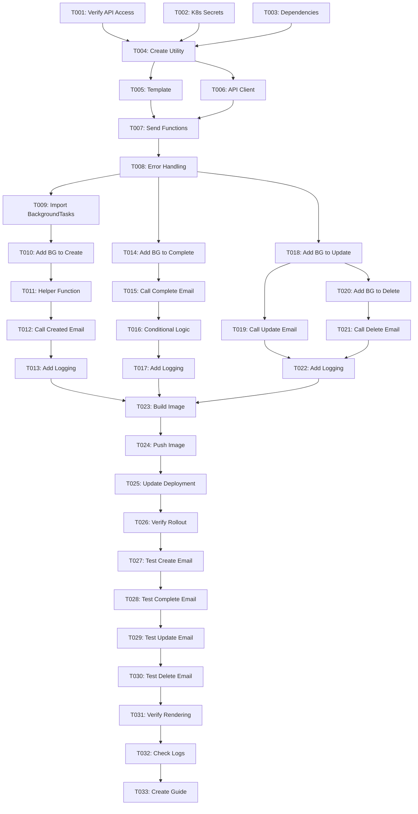

# Tasks: Email Notification System

**Input**: Design documents from `/specs/006-fix-email/`
**Prerequisites**: plan.md, spec.md

**Tests**: Manual tests in production environment (automated tests optional)

**Organization**: Tasks are grouped by user story to enable independent implementation and testing of each story.

## Format: `[ID] [P?] [Story] Description`

- **[P]**: Can run in parallel (different files, no dependencies)
- **[Story]**: Which user story this task belongs to (e.g., US1, US2, US3)
- Include exact file paths in descriptions

## Path Conventions

- **Backend**: `backend/app/`
- **Kubernetes**: `k8s/backend/`
- **Tests**: `backend/tests/`

---

## Phase 1: Setup (Shared Infrastructure)

**Purpose**: Environment configuration and dependencies

- [ ] T001 Verify email API access and credentials in production
- [ ] T002 [P] Add EMAIL_API_URL and EMAIL_API_KEY to Kubernetes secrets
- [ ] T003 [P] Update backend requirements.txt with httpx dependency

---

## Phase 2: Foundational (Blocking Prerequisites)

**Purpose**: Core infrastructure that MUST be complete before ANY user story can be implemented

- [ ] T004 Create email notification utility in backend/app/utils/email_notifier.py
- [ ] T005 Implement HTML email template with status badges in backend/app/utils/email_notifier.py
- [ ] T006 Add email API client with httpx in backend/app/utils/email_notifier.py
- [ ] T007 Add email sending functions (created/updated/completed/deleted) in backend/app/utils/email_notifier.py
- [ ] T008 Implement error handling and logging for email sending in backend/app/utils/email_notifier.py

**Checkpoint**: Email notification utility ready - user story implementation can now begin in parallel

---

## Phase 3: User Story 1 - Task Creation Email Notification (Priority: P1) 🎯 MVP

**Goal**: Users receive immediate email notification when they create a new task

**Independent Test**: Create a task via API and verify email arrives at n00bi2761@gmail.com

### Implementation for User Story 1

- [ ] T009 [P] [US1] Import BackgroundTasks in backend/app/api/tasks.py
- [ ] T010 [P] [US1] Add background_tasks parameter to create_task endpoint in backend/app/api/tasks.py
- [ ] T011 [US1] Add _send_email_notification helper function in backend/app/api/tasks.py
- [ ] T012 [US1] Call send_task_created_email when task is created in backend/app/api/tasks.py
- [ ] T013 [US1] Add email sending logging to create_task endpoint in backend/app/api/tasks.py

**Checkpoint**: Task creation triggers email notification

---

## Phase 4: User Story 2 - Task Completion Email Notification (Priority: P2)

**Goal**: Users receive congratulatory email notification when they mark a task as complete

**Independent Test**: Create a task, mark it complete, and verify congratulatory email arrives

### Implementation for User Story 2

- [ ] T014 [P] [US2] Add background_tasks parameter to toggle_task_completion endpoint in backend/app/api/tasks.py
- [ ] T015 [US2] Call send_task_completed_email when task is completed in backend/app/api/tasks.py
- [ ] T016 [US2] Add completion email conditional logic (only when completed=True) in backend/app/api/tasks.py
- [ ] T017 [US2] Add email sending logging to completion endpoint in backend/app/api/tasks.py

**Checkpoint**: Task completion triggers congratulatory email notification

---

## Phase 5: User Story 3 - Task Update and Delete Notifications (Priority: P3)

**Goal**: Users receive email notifications when they update task details or delete a task

**Independent Test**: Update a task and verify update email, then delete task and verify deletion email

### Implementation for User Story 3

- [ ] T018 [P] [US3] Add background_tasks parameter to update_task endpoint in backend/app/api/tasks.py
- [ ] T019 [US3] Call send_task_updated_email when task is updated in backend/app/api/tasks.py
- [ ] T020 [US3] Add background_tasks parameter to delete_task endpoint in backend/app/api/tasks.py
- [ ] T021 [US3] Call send_task_deleted_email when task is deleted in backend/app/api/tasks.py
- [ ] T022 [US3] Add email sending logging to update and delete endpoints in backend/app/api/tasks.py

**Checkpoint**: Task update and delete operations trigger email notifications

---

## Phase 6: Polish & Cross-Cutting Concerns

**Purpose**: Deployment, testing, and documentation

- [ ] T023 [P] Build Docker image with unique tag (e.g., direct-email-v1)
- [ ] T024 [P] Push Docker image to DigitalOcean registry
- [ ] T025 [P] Update Kubernetes deployment with new image tag
- [ ] T026 Verify deployment rollout status
- [ ] T027 Test task creation email in production environment
- [ ] T028 Test task completion email in production environment
- [ ] T029 Test task update email in production environment
- [ ] T030 Test task deletion email in production environment
- [ ] T031 Verify email rendering in Gmail and Outlook clients
- [ ] T032 Check backend logs for email sending confirmation
- [ ] T033 Create quickstart testing guide in specs/006-fix-email/quickstart.md

---

## Dependencies

## Parallel Execution Opportunities

### Phase 1 (Setup) - All tasks can run in parallel
- T001, T002, T003 can all run simultaneously

### Phase 2 (Foundational) - Partial parallelism after T004
- T005, T006 can run in parallel after T004
- T007 depends on T005, T006
- T008 depends on T007

### Phase 3 (US1) - Sequential after setup
- T009, T010 can run in parallel
- T011 depends on T010
- T012 depends on T011
- T013 depends on T012

### Phase 4 (US2) - Can run in parallel with US1 after foundational
- T014, T015, T016, T017 run within US2 story

### Phase 5 (US3) - Can run in parallel with US1/US2 after foundational
- T018, T019 run together
- T020, T021 run together
- T022 depends on T019, T021

### Phase 6 (Polish) - All can run in parallel after implementation
- T023, T024, T025, T026 can all run simultaneously
- T027, T028, T029, T030 can run in parallel after T026
- T031, T032 can run in parallel after tests
- T033 depends on T032

## Implementation Strategy

### MVP Scope (Minimum Viable Product)
**User Story 1 (Task Creation Email)** provides core value:
- Users get confirmation when tasks are created
- Foundation for all other notifications
- Can be tested and deployed independently

### Incremental Delivery
1. **Sprint 1**: Phase 1-3 (Setup + US1) → Task creation emails working
2. **Sprint 2**: Phase 4 (US2) → Add completion emails
3. **Sprint 3**: Phase 5 (US3) → Add update/delete emails
4. **Sprint 4**: Phase 6 (Polish) → Production deployment and testing

### Independent Testing Criteria

**User Story 1**: Create task → Email arrives at registered email address
**User Story 2**: Complete task → Congratulatory email arrives
**User Story 3**: Update/delete task → Notification email arrives

Each story can be tested and validated independently before moving to the next story.

## Task Summary

- **Total Tasks**: 33
- **Setup Phase**: 3 tasks
- **Foundational Phase**: 5 tasks
- **User Story 1**: 5 tasks
- **User Story 2**: 4 tasks
- **User Story 3**: 5 tasks
- **Polish Phase**: 11 tasks

**Parallel Opportunities**: 15 tasks can run in parallel (marked with [P])
**Estimated Critical Path**: ~20 tasks in sequential order

## Format Validation

All tasks follow the checklist format:
- ✅ Checkbox `- [ ]`
- ✅ Task ID (T001-T033)
- ✅ [P] marker for parallelizable tasks
- ✅ [Story] label for user story tasks
- ✅ Clear description with file paths
